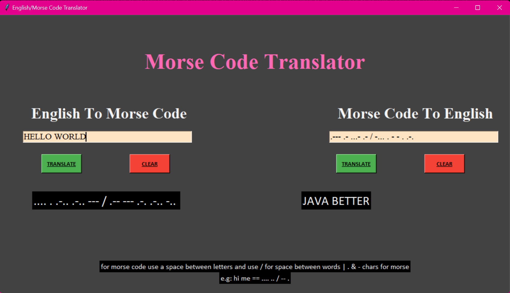

# Morse Code Translator

## Introduction

This Python project is a Morse Code Translator developed using Tkinter, the standard GUI toolkit for Python. The application allows users to convert English to Morse code and vice versa, providing a simple and interactive way to explore both Morse code and GUI application development.

## Features

- **Translate English to Morse Code:** Users can input text in English and convert it to Morse code.
- **Translate Morse Code to English:** Users can input Morse code (using dots `.` and dashes `-`, separated by spaces for letters and slashes `/` for spaces) to translate it back to English.
- **Clear Input:** Buttons to easily clear the current input fields.

## Screenshots

